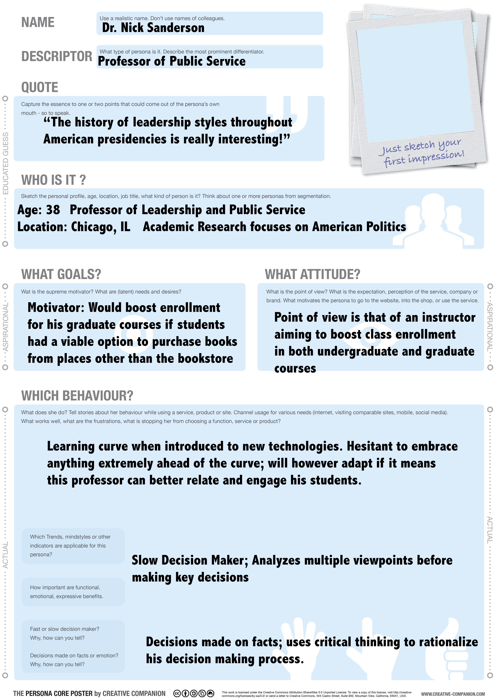
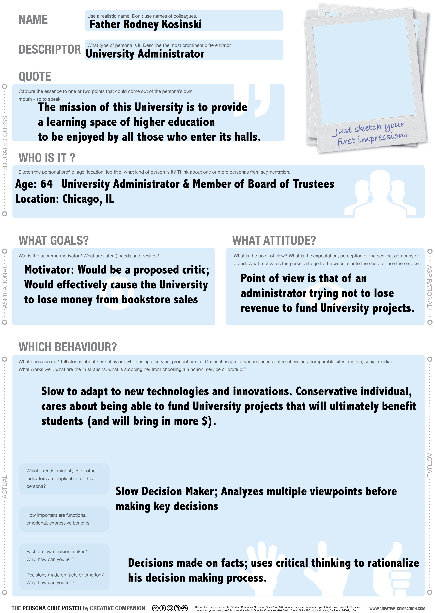

storify.md

# Audience Map

##Directly Related to Idea:
- Students
- Instructors/Professors
- University Administration
- DePaul Bookstore

##Peripherally Related to Idea:
- Bookstore Employees
- Textbook Companies
- Students from other local universities
- Online textbook retail companies

##Fans / Critics
Fans:
- Students
- Students from other local universities
- Instructors/Professors

Critics:
- University Administration
- Textbook Companies
- Online textbook retail companies

# Personas

# Features
- 1) Search Engine in order to search for books by class, professor, edition or ISBN
- 2) Marketplace function in order to see books from multiple sellers
- 3) Price comparison tool; aggregates prices on the internet to determine fair value

# User Flow
##Feature 1
